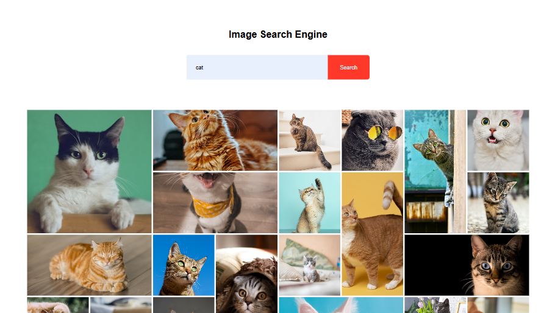

# 🖼️ Image Search Engine

A sleek and simple web app to search for high-quality images using the [Unsplash Developer API](https://unsplash.com/developers). Just type in what you're looking for and get a gallery of beautiful, royalty-free images in seconds.

👉 **Live Demo**: [Image Search Engine](https://iamchiranjeevir.github.io/Image-Search-Engine/)

## 🚀 Features

- 🔍 Real-time image search powered by Unsplash
- 🖼️ Dynamic image gallery layout
- 🎯 Responsive and mobile-friendly design
- ⚡ Lightning-fast and minimal UI for seamless experience

## 📸 Preview

 <!-- Optional: add a screenshot of your app -->

## 🛠️ Built With

- **HTML5**
- **CSS3**
- **JavaScript (Vanilla JS)**
- **Unsplash API**

## 📦 How to Use

1. Clone the repository:
   ```bash
   git clone https://github.com/your-username/Image-Search-Engine.git
   cd Image-Search-Engine

## 🙌 Acknowledgements

- Thanks to [Unsplash](https://unsplash.com/) for providing such a beautiful collection of free images via their API.

## 📫 Contact

Got feedback or suggestions? Reach out to me:

- GitHub: [@iamchiranjeevir](https://github.com/iamchiranjeevir)
- Email: iamchiranjeeviramakrishna@gmail.com
